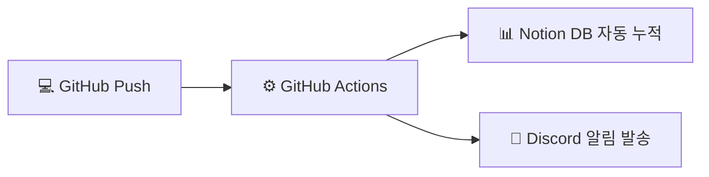

# 💻 Algorithm Study (알고리즘 스터디)

> **알고리즘 스터디 저장소입니다.**  
> 매일/매주 알고리즘 문제를 해결하고 코드 리뷰를 통해 피드백을 주고받으며, Notion 및 Discord 연동을 통해 풀이 현황을 자동 기록합니다.

---

## 📂 저장소 폴더 구조 (Folder Structure)

본 저장소는 문제별로 스터디원들의 다양한 풀이 코드를 모아서 비교하고, 코드 리뷰를 원활하게 진행할 수 있도록 **문제 중심의 폴더 구조**를 사용합니다.

```text
├── [플랫폼]/
│   └── [난이도]/
│       └── [문제번호. 문제이름]/
│           └── [스터디원 이름].[확장자]
```

### 💡 경로 구성 예시
* **백준 (Baekjoon):** `백준/Gold/1002. 터렛/홍길동.py`
* **프로그래머스 (Programmers):** `프로그래머스/Level2/타겟 넘버/이영희.js`
* **리트코드 (LeetCode):** `리트코드/Easy/1. Two Sum/김철수.java`

---

## 🚀 참여 방법 (How to Participate)

1. **본 저장소를 로컬에 Clone 합니다.**
   ```bash
   git clone https://github.com/ydh0318/algorithmsstudy.git
   ```
2. **문제를 해결한 후, 약속된 폴더 구조에 맞게 코드를 저장합니다.**
   * 예: `백준/Silver/1920. 수 찾기/` 폴더 아래에 `본인이름.py` (혹은 `.cpp`, `.java` 등) 저장
3. **코드 커밋 및 푸시를 진행합니다.**
   ```bash
   git add .
   git commit -m "solve: 백준 1920 수 찾기 (본인이름)"
   git push origin main
   ```

---

## 🤖 스터디 자동화 파이프라인 (Automation)

이 저장소는 **GitHub Actions**, **Notion API**, **Discord Webhook**을 사용해 완벽한 풀이 인증 자동화 시스템을 갖추고 있습니다.



### 1. 📊 Notion 풀이 현황판
* 스터디원이 코드를 push하면 **[노션 풀이 현황판]** 데이터베이스 테이블에 문제명, 해결자, 난이도, 플랫폼, 코드 파일 뷰어 링크가 실시간으로 자동 기록됩니다.

### 2. 💬 디스코드 실시간 알림
* 문제가 성공적으로 노션에 기록되면, 스터디방 디스코드 알림 채널로 예쁜 **축하 메시지 카드(Embed)**가 자동 전송되어 서로 풀이 현황을 즉시 공유할 수 있습니다.

---

## 👥 스터디원 (Members)

| 이름 | GitHub 프로필 | 백준 프로필 (solved.ac) | 주 사용 언어 |
| :---: | :---: | :---: | :---: |
| **리더** | [@GitHub_ID](https://github.com/ydh0318) | [백준_ID](https://solved.ac) | Python / C++ |
